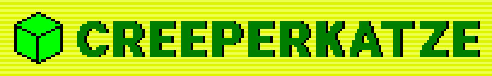

  

# The Creeperkatze Website
### Here you can:
- Check out my games
- Test yourself with fun quizzes
- Marvel at my programming skills
- Read interesting blogs (barely updated)
- Generate cat photos
- & do much more

What are you waiting for?\
[Go check it out!](https://creeperkatze.github.io)